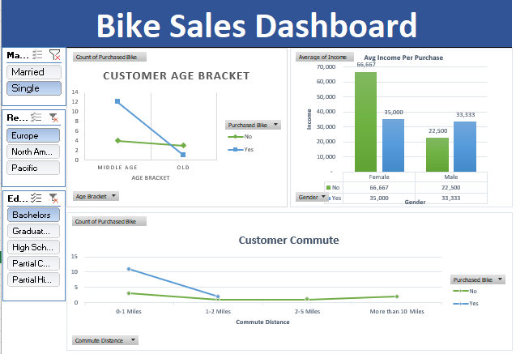

# Bike Sales Data Analysis & Dashboard

A data analysis and dashboard project created using Microsoft Excel to explore
customer demographics, income, commute distance, and bike purchasing behavior.

## 🛠️ Tools & Skills

- Microsoft Excel
- Pivot Tables
- Data Cleaning
- Data Analysis
- Dashboard Visualization

## 📊 Project Overview

The project involved cleaning and organizing bike sales data, analyzing the
data using Pivot Tables, and presenting key findings through an interactive
Excel dashboard.

## 🔎 Analysis

The analysis explores relationships between bike purchases and various
customer characteristics, including:

- Gender
- Income
- Home Ownership
- Commute Distance
- Age Group

## 📁 Workbook Structure

The Excel workbook contains the following:

- **Bike Buyers** — Original dataset
- **Working Sheet** — Cleaned and processed data
- **Pivot Table** — Data analysis using Pivot Tables
- **Dashboard** — Interactive Excel dashboard presenting key findings

## 📈 Dashboard

The final dashboard provides a visual summary of the analyzed bike sales
data, making the results easier to interpret and compare.

## 📂 Project Files

- **Bike_Sales_Data_Analysis_Dashboard.xlsx** — Excel workbook containing
  the original data, cleaned data, Pivot Table analysis, and dashboard.
- **excel_dashboard.png** — Preview of the completed dashboard.
